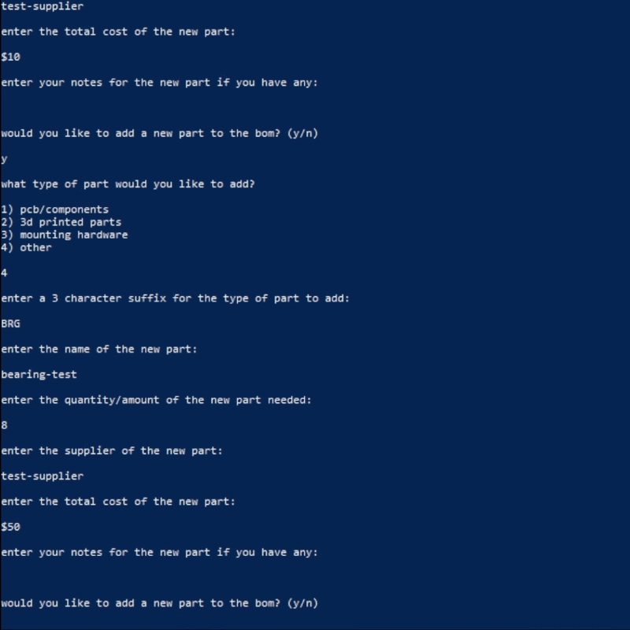

<h1>bom writer</h1>
<h2>automated .csv bill of materials generator and .md table converter for github repos.</h2>
<h3 align="center"></h3>
<h3>about the project</h3>
<p>after doing 4 hardware projects i decided that making bills of materials is too much effort and can be automated "decently simply" - so i will be making a .csv bill of materials writer and a converter into .md for my future github repos :)</p>
<hr>
<h3>installation + requirements</h3>
<p>bom-writer requires <b>python 3.9 or newer</b> to work.</p>
<p>bom-writer requires <b>tkinter</b> (included on most standard python installs, may need to be installed seperately on some linux distributions).</p>
<p>install it from pypi by running:</p>

```
pip install bom-writer
```
<hr>
<h3>creating a bill of materials</h3>
<p>run the program with:</p>

```
bom-writer
```
and this screen should appear
```
welcome to the bill of materials writer
by yours truly, andrei acatalinei

what would you like to do?

1) create a new bill of materials
2) convert existing bill of materials to markdown table
3) exit the program
```
by choosing the first option, the intuitive menu system will help you navigate creating a new bill of materials!
<h3 align="center"></h3>
<hr>
<h3>converting a bill of materials to markdown</h3>
<p>run the program with:</p>

```
bom-writer
```
by choosing the second option and selecting the file to convert, the program instantly converts the .csv file to .md
<h3 align="center"></h3>
<b>note: the converter may not work with existing boms as the formatting must be in the way that bom-writer already processes it - so it is best practice to both make the .csv with bom-writer and convert it with bom-writer :)</b>

<hr>

<h3>features</h3>
<ul>
  <li>create boms as .csv files</li>
  <li>automatically number parts</li>
  <li>automatically categorise parts with designators</li>
  <li>automatically calculate unit costs</li>
  <li>record suppliers and costs</li>
  <li>add notes to parts</li>
  <li>convert .csv boms to .md</li>
</ul>

<hr>

<h3>license</h3>
<p>bom writer is open source and licensed under the MIT License</p>
